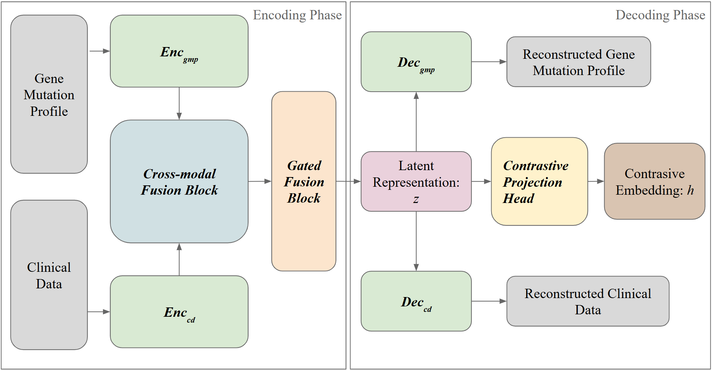

# Surv-M²AC: Masked Multimodal Autoencoders with Contrastive Learning for Cancer Survival Prediction

**Authors:** Yancheng Liu, David Ning, Yang Xiang  
**Institution:** Department of Computer Science, Brown University  
**Corresponding Author:** yancheng_liu@brown.edu  

## 🧬 Overview

**Surv-M²AC** is a lightweight and interpretable model for pan-cancer survival analysis that combines:
- **Modality-specific masked autoencoders**
- **Bidirectional Feature-wise Linear Modulation (Bi-FiLM)** for cross-modal fusion
- **Contrastive learning** for robust patient representation

This framework is optimized for sparse real-world data, using only binary gene mutation profiles and limited clinical features. Despite minimal inputs, Surv-M²AC achieves competitive performance with fewer parameters and better generalizability across cancer types.

## 🔍 Key Features

- 🧠 **Modality-Specific Encoders:** Deep residual blocks for gene mutation profiles and lightweight blocks for clinical data.
- 🔄 **Bi-FiLM Fusion:** Cross-modal interaction through mutual feature-wise conditioning.
- 🧩 **Masked Reconstruction:** Robust autoencoding under partial feature dropout.
- 🎯 **Contrastive Learning:** SimCLR-style loss ensures representation stability across corruptions.
- 📈 **Downstream Performance:** Achieves an average C-index of **0.744** on MSK-IMPACT data.
- 🧠 **Interpretability:** Integrated Gradients reveal biologically meaningful feature attributions.

## 📂 Dataset

Surv-M²AC is evaluated on a pan-cancer dataset from **MSK-IMPACT**, comprising:
- 22,284 patients across 5 major cancer types
- 1,165 binarized gene mutation subtypes
- 16 curated clinical features

Please note: Due to privacy concerns, the dataset is not included in this repository. Contact the authors for access or guidance on data preprocessing.

## 🏗️ Architecture

<p align="center">
  
</p>

- **Encoders:** Separate MLP-based encoders with residual and SE blocks.
- **Fusion Layer:** Bi-FiLM block conditions each modality on the other.
- **Decoders:** Two-layer MLPs reconstruct masked inputs.
- **Projection Head:** Outputs contrastive embeddings \( h \).

## ⚙️ Training Objective

Combined loss:
- **Masked Reconstruction Loss** for gene and clinical modalities
- **Contrastive Loss (InfoNCE)** between two masked views of each sample

Total loss:
```
L_total = L_recon + β * L_contrastive
```

## 📊 Results

| Model Variant                | Avg. C-Index |
|-----------------------------|--------------|
| DeepSurv Baseline           | 0.706        |
| Vanilla Autoencoder         | 0.704        |
| Surv-M²AC (no fusion/losses)| 0.724        |
| **Full Surv-M²AC**          | **0.744**    |

- Kaplan–Meier curves show better risk group stratification.
- UMAP visualizations confirm biologically coherent embeddings.

## 📁 Repository Structure

```
.
├── data_processing/          # Preprocessed MSK dataset
├── env/                      # Environment setup
├── figures/                  # Model architecture and results
├── models/                   # Main Surv-M²AC model
├── results/                  # Model evaluation results
├── utils/                    # Training and evaluation scripts
├── experiments.py            # Experiment configuration for Surv-M²AC
├── mlp_baseline.ipynb        # MLP baseline model (DeepSurv)
├── README.md
├── Surv-MAC.ipynb            # Surv-M²AC model notebook
└── Surv-MAC.pdf              # Surv-M²AC model paper
```

## 📌 Requirements

- Python ≥ 3.8
- PyTorch ≥ 1.10
- NumPy, pandas, scikit-learn
- Matplotlib, UMAP
- Lifelines
- Captum

Install dependencies:

```bash
pip install -r ./env/requirements.txt
```

## 📬 Contact

For questions or collaboration inquiries, please contact:  
**Yancheng Liu** – yancheng_liu@brown.edu
